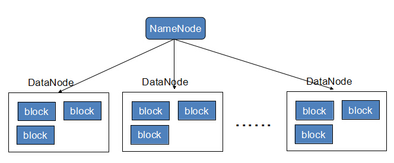
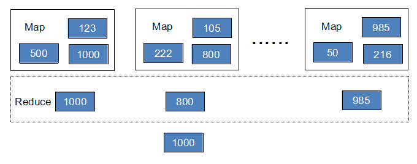
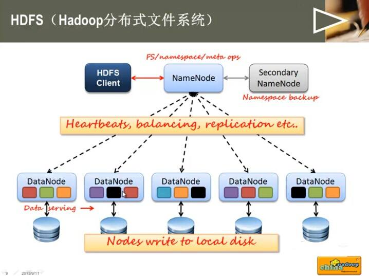
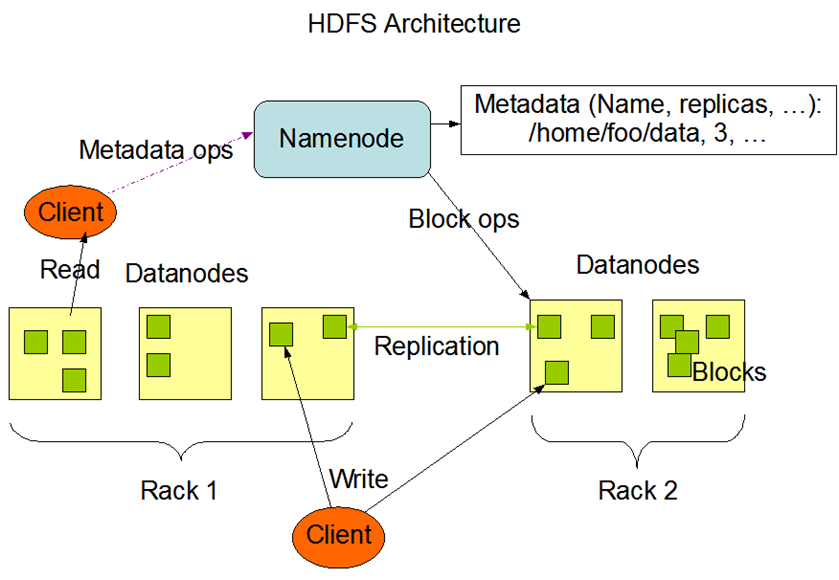

# Hadoop

目录：
* 目录
{:toc}

## Hadoop核心

Hadoop 的核心是 HDFS 和 Map-Reduce，而两者只是理论基础，不是具体可使用的高级应用，Hadoop生态有很多经典子项目，比如 HBase、Hive等，这些都是基于HDFS和MapReduce发展出来的。要想了解Hadoop，就必须知道HDFS和MapReduce是什么。

### HDFS

HDFS（Hadoop Distributed File System，Hadoop分布式文件系统），它是一个高度容错性的系统，适合部署在廉价的机器上。HDFS能提供高吞吐量的数据访问，适合那些有着超大数据集（large data set）的应用程序。
 
HDFS的设计特点是：

* **大数据文件**，非常适合上T级别的大文件或者一堆大数据文件的存储，如果文件只有几个G甚至更小就没啥意思了。
* **文件分块存储**，HDFS会将一个完整的大文件平均分块存储到不同计算器上，它的意义在于读取文件时可以同时从多个主机取不同区块的文件，多主机读取比单主机读取效率要高得多得多。
* **流式数据访问**，一次写入多次读写，这种模式跟传统文件不同，它不支持动态改变文件内容，而是要求让文件一次写入就不做变化，要变化也只能在文件末添加内容。
* **廉价硬件**，HDFS可以应用在普通PC机上，这种机制能够让给一些公司用几十台廉价的计算机就可以撑起一个大数据集群。
* **硬件故障**，HDFS认为所有计算机都可能会出问题，为了防止某个主机失效读取不到该主机的块文件，它将同一个文件块副本分配到其它某几个主机上，如果其中一台主机失效，可以迅速找另一块副本取文件。
 
HDFS的关键元素：

* **Block**：将一个文件进行分块，通常是64M。
* **DataNode**：分布在廉价的计算机上，用于存储Block块文件。
* **NameNode**：保存整个文件系统的目录信息、文件信息及分块信息，这是由唯一一台主机专门保存，当然这台主机如果出错，NameNode就失效了。在Hadoop2开始支持 **activity-standy** 模式----如果主NameNode失效，启动备用主机运行NameNode。

 

### MapReduce

通俗说MapReduce是一套从海量源数据提取分析元素最后返回结果集的编程模型，将文件分布式存储到硬盘是第一步，而从海量数据中提取分析我们需要的内容就是MapReduce做的事了。
 
下面以一个计算海量数据最大值为例：一个银行有上亿储户，银行希望找到存储金额最高的金额是多少，按照传统的计算方式，我们会这样：

```java
Long moneys[] ...  
Long max = 0L;  
for(int i=0;i<moneys.length;i++){  
  if(moneys[i]>max){  
    max = moneys[i];  
  }  
}  
```

如果计算的数组长度少的话，这样实现是不会有问题的，还是面对海量数据的时候就会有问题。

MapReduce会这样做：首先数字是分布存储在不同块中的，以某几个块为一个Map，计算出Map中最大的值，然后将每个Map中的最大值做Reduce操作，Reduce再取最大值给用户。

 

MapReduce的基本原理就是：将大的数据分析分成小块逐个分析，最后再将提取出来的数据汇总分析，最终获得我们想要的内容。当然怎么分块分析，怎么做Reduce操作非常复杂，Hadoop已经提供了数据分析的实现，我们只需要编写简单的需求命令即可达成我们想要的数据。

### 总结

总的来说Hadoop适合应用于大数据存储和大数据分析的应用，适合于服务器几千台到几万台的集群运行，支持PB级的存储容量。

Hadoop典型应用有：搜索、日志处理、推荐系统、数据分析、视频图像分析、数据保存等。

## HDFS
全称Hadoop distributed file system，简称HDFS，是一个**分布式文件系统**。它是谷歌的GFS提出之后出现的另外一种文件系统。它有一定高度的容错性，而且提供了高吞吐量的数据访问，非常适合大规模数据集上的应用。HDFS 提供了一个高度容错性和高吞吐量的海量数据存储解决方案。
 
在最初，HADOOP是作为Apache Nutch搜索引擎项目的基础架构而开发的，后来由于它独有的特性，让它成为HADOOP CORE项目的一部分。



### HDFS的设计思路

简单说一下它的设计思路，大家就可以理解为什么它可以提供高吞吐量的数据访问和适合大规模数据集的应用的特性。

首先HDFS的设计之初就是针对超大文件的存储的，小文件不会提高访问和存储速度，反而会降低；其次它采用了最高效的访问模式，也就是经常所说的**流式数据访问**，特点就是**一次写入多次读取**；再有就是它运行在普通的硬件之上的，即使硬件故障，也就通过容错来保证数据的高可用。

### HDFS核心概念

* **NameNode**：主要负责存储一些metadata信息，主要包括文件目录、block和文件对应关系，以及block和datanode的对应关系
* **DataNode**：负责存储数据，上面我们所说的高度的容错性大部分在datanode上实现的，还有一部分容错性是体现在namenode和secondaryname，还有jobtracker的容错等。
* **Block**：大文件的存储会被分割为多个block进行存储。默认为64MB，每一个blok会在多个datanode上存储多份副本，默认为3份。这些设置都能够通过配置文件进行更改。

### HDFS的基础架构图


### HDFS优点：

* **高吞吐量访问**：HDFS的每个block分布在不同的rack上，在用户访问时，HDFS会计算使用最近和访问量最小的服务器给用户提供。由于block在不同的rack上都有备份，所以不再是单数据访问，所以速度和效率是非常快的。另外HDFS可以并行从服务器集群中读写，增加了文件读写的访问带宽。

* **高容错性**：上面简单的介绍了一下高度容错。系统故障是不可避免的，如何做到故障之后的数据恢复和容错处理是至关重要的。HDFS通过多方面保证数据的可靠性，多分复制并且分布到物理位置的不同服务器上，数据校验功能、后台的连续自检数据一致性功能，都为高容错提供了可能。

* **容量扩充**：因为HDFS的block信息存放到namenode上，文件的block分布到datanode上，当扩充的时候，仅仅添加datanode数量，系统可以在不停止服务的情况下做扩充，不需要人工干预。

**3个不同的位置：**
* 本地电脑
* 服务器(Mac:terminal/终端 Windows:Xshell scureCRT)
* 集群

### HDFS常见命令

HDFS上的数据，分布在不同的地方，我们有一些命令可以用于 增加/查看/删除 等数据操作。

```shell
#显示/下的所有文件夹信息
hadoop fs -ls /

#递归显示所有文件夹和子文件(夹)
hadoop fs -lsr

#创建/user/hadoop目录
hadoop fs -mkdir /user/hadoop

#把a.txt放到集群/user/hadoop/文件夹下
hadoop fs -put a.txt /user/hadoop/

#把集群上的/user/hadoop/a.txt拉到本地/目录下
hadoop fs -get /user/hadoop/a.txt /

#集群上复制文件
hadoop fs -cp src dst

#集群上移动文件
hadoop fs -mv src dst

#查看集群上文件/user/hadoop/a.txt的内容
hadoop fs -cat /user/hadoop/a.txt

#删除集群上/user/hadoop/a.txt文件
hadoop fs -rm /user/hadoop/a.txt

#删除目录和目录下所有文件
hadoop fs -rmr /user/hadoop/a.txt

#与hadoop fs -put功能类似
hadoop fs -copyFromLocal localsrc dst 

#将本地文件上传到hdfs，同时删除本地文件
hadoop fs -moveFromLocal localsrc dst 
```
