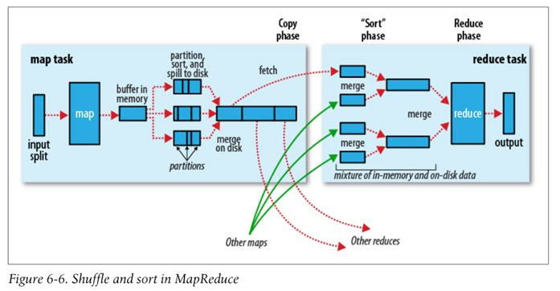

# Hadoop Streaming

目录：
* 目录
{:toc}

## Hadoop Streaming完成大数据处理详解

### Hadoop Streaming完成大数据处理详解



Hadoop生态有非常多的工具可以用于大数据的管理和数据处理。这里我们给大家详细介绍一下，如何使用Hadoop Streaming这个方式，对大数据进行处理。

### Hadoop Streaming
Hadoop streaming是Hadoop的一个工具， 它帮助用户创建和运行一类特殊的map/reduce作业， 这些特殊的map/reduce作业是由一些可执行文件或脚本文件充当mapper或者reducer。例如在hadoop环境下的命令行可以执行：

```
$HADOOP_HOME/bin/hadoop  jar \
$HADOOP_HOME/hadoop-streaming.jar \
    -input myInputDirs \
    -output myOutputDir \
    -mapper /bin/cat \
    -reducer /bin/wc
```

看不懂别着急，咱们马上来分析一下上述的代码。

### Streaming工作原理
在上面的例子里，mapper和reducer都是可执行文件，它们从标准输入读入数据（一行一行读）， 并把计算结果发给标准输出。Streaming工具会创建一个Map/Reduce作业， 并把它发送给合适的集群，同时监视这个作业的整个执行过程。

如果一个可执行文件被用于mapper，则在mapper初始化时， 每一个mapper任务会把这个可执行文件作为一个单独的进程启动。 <br>
mapper任务运行时，它把输入切分成行并把每一行提供给可执行文件进程的标准输入。 同时，mapper收集可执行文件进程标准输出的内容，并把收到的每一行内容转化成key/value对，作为mapper的输出。 <br>
默认情况下，一行中第一个tab之前的部分作为key，之后的（不包括tab）作为value。 如果没有tab，整行作为key值，value值为null。不过，这可以定制，在下文中将会讨论如何自定义key和value的切分方式。

如果一个可执行文件被用于reducer，每个reducer任务会把这个可执行文件作为一个单独的进程启动。<br>
Reducer任务运行时，它把输入切分成行并把每一行提供给可执行文件进程的标准输入。 同时，reducer收集可执行文件进程标准输出的内容，并把每一行内容转化成key/value对，作为reducer的输出。 <br>
默认情况下，一行中第一个tab之前的部分作为key，之后的（不包括tab）作为value。在下文中将会讨论如何自定义key和value的切分方式。

这是Map/Reduce框架和streaming mapper/reducer之间的基本通信协议。

用户也可以使用java类作为mapper或者reducer。
上面的例子与这里的代码等价：

```
$HADOOP_HOME/bin/hadoop  jar \
$HADOOP_HOME/hadoop-streaming.jar \
    -input myInputDirs \
    -output myOutputDir \
    -mapper org.apache.hadoop.mapred.lib.IdentityMapper \
    -reducer /bin/wc
```

用户可以设定stream.non.zero.exit.is.failure true 或false 来表明streaming task的返回值非零时是 Failure 还是Success。默认情况，streaming task返回非零时表示失败。

### 将文件打包到提交的作业中
我们要开始讲关键点了，并不是每位同学都对java熟悉程度这么高。没关系，hadoop允许我们用脚本语言完成处理过程，并把文件打包提交到作业中，完成大数据的处理。

<font color="red">任何可执行文件都可以被指定为mapper/reducer。这些可执行文件不需要事先存放在集群上；如果在集群上还没有，则需要用-file选项让framework把可执行文件作为作业的一部分，一起打包提交。</font>例如：

```
$HADOOP_HOME/bin/hadoop  jar $HADOOP_HOME/hadoop-streaming.jar \
    -input myInputDirs \
    -output myOutputDir \
    -mapper myPythonScript.py \
    -reducer /bin/wc \
    -file myPythonScript.py
```

<font color="red">上面的例子描述了一个用户把可执行python文件作为mapper。 其中的选项“-file myPythonScirpt.py”使可执行python文件作为作业提交的一部分被上传到集群的机器上。</font>

除了可执行文件外，其他mapper或reducer需要用到的辅助文件（比如字典，配置文件等）也可以用这种方式打包上传。例如：

```
$HADOOP_HOME/bin/hadoop  jar $HADOOP_HOME/hadoop-streaming.jar \
    -input myInputDirs \
    -output myOutputDir \
    -mapper myPythonScript.py \
    -reducer /bin/wc \
    -file myPythonScript.py \
    -file myDictionary.txt
```

### Streaming选项与用法
#### 只使用Mapper的作业
有时只需要map函数处理输入数据。这时只需把mapred.reduce.tasks设置为零，Map/reduce框架就不会创建reducer任务，mapper任务的输出就是整个作业的最终输出。

为了做到向下兼容，Hadoop Streaming也支持“-reduce None”选项，它与“-jobconf mapred.reduce.tasks=0”等价。

#### 为作业指定其他插件
和其他普通的Map/Reduce作业一样，用户可以为streaming作业指定其他插件：

>
   -inputformat JavaClassName
   -outputformat JavaClassName
   -partitioner JavaClassName
   -combiner JavaClassName
   
用于处理输入格式的类要能返回Text类型的key/value对。如果不指定输入格式，则默认会使用TextInputFormat。 因为TextInputFormat得到的key值是LongWritable类型的（其实key值并不是输入文件中的内容，而是value偏移量）， 所以key会被丢弃，只把value用管道方式发给mapper。

用户提供的定义输出格式的类需要能够处理Text类型的key/value对。如果不指定输出格式，则默认会使用TextOutputFormat类。

### Hadoop Streaming中的大文件和档案
任务使用-cacheFile和-cacheArchive选项在集群中分发文件和档案，选项的参数是用户已上传至HDFS的文件或档案的URI。这些文件和档案在不同的作业间缓存。用户可以通过fs.default.name.config配置参数的值得到文件所在的host和fs_port。

这个是使用-cacheFile选项的例子：

```
-cacheFile hdfs://host:fs_port/user/testfile.txt#testlink
```
在上面的例子里，url中#后面的部分是建立在任务当前工作目录下的符号链接的名字。这里的任务的当前工作目录下有一个“testlink”符号链接，它指向testfile.txt文件在本地的拷贝。如果有多个文件，选项可以写成：

```
-cacheFile hdfs://host:fs_port/user/testfile1.txt#testlink1 -cacheFile hdfs://host:fs_port/user/testfile2.txt#testlink2
```

-cacheArchive选项用于把jar文件拷贝到任务当前工作目录并自动把jar文件解压缩。例如：

```
-cacheArchive hdfs://host:fs_port/user/testfile.jar#testlink3
```
在上面的例子中，testlink3是当前工作目录下的符号链接，它指向testfile.jar解压后的目录。

下面是使用-cacheArchive选项的另一个例子。其中，input.txt文件有两行内容，分别是两个文件的名字：testlink/cache.txt和testlink/cache2.txt。“testlink”是指向档案目录（jar文件解压后的目录）的符号链接，这个目录下有“cache.txt”和“cache2.txt”两个文件。

```
$HADOOP_HOME/bin/hadoop  jar $HADOOP_HOME/hadoop-streaming.jar \
                  -input "/user/me/samples/cachefile/input.txt"  \
                  -mapper "xargs cat"  \
                  -reducer "cat"  \
                  -output "/user/me/samples/cachefile/out" \  
                  -cacheArchive 'hdfs://hadoop-nn1.example.com/user/me/samples/cachefile/cachedir.jar#testlink' \  
                  -jobconf mapred.map.tasks=1 \
                  -jobconf mapred.reduce.tasks=1 \ 
                  -jobconf mapred.job.name="Experiment"
```

再来看一样过程和内容
```
$ ls test_jar/
cache.txt  cache2.txt

$ jar cvf cachedir.jar -C test_jar/ .
added manifest
adding: cache.txt(in = 30) (out= 29)(deflated 3%)
adding: cache2.txt(in = 37) (out= 35)(deflated 5%)

$ hadoop dfs -put cachedir.jar samples/cachefile

$ hadoop dfs -cat /user/me/samples/cachefile/input.txt
testlink/cache.txt
testlink/cache2.txt

$ cat test_jar/cache.txt 
This is just the cache string

$ cat test_jar/cache2.txt 
This is just the second cache string

$ hadoop dfs -ls /user/me/samples/cachefile/out      
Found 1 items
/user/me/samples/cachefile/out/part-00000  <r 3>   69

$ hadoop dfs -cat /user/me/samples/cachefile/out/part-00000
This is just the cache string   
This is just the second cache string
```

### 为作业指定附加配置参数
用户可以使用“-jobconf <n>=<v>”增加一些配置变量。例如：

```
$HADOOP_HOME/bin/hadoop  jar $HADOOP_HOME/hadoop-streaming.jar \
    -input myInputDirs \
    -output myOutputDir \
    -mapper org.apache.hadoop.mapred.lib.IdentityMapper\
    -reducer /bin/wc \
    -jobconf mapred.reduce.tasks=2
```
上面的例子中，-jobconf mapred.reduce.tasks=2表明用两个reducer完成作业。<br>
-jobconf mapred.map.tasks=2表明用两个mapper完成作业。

### 其他选项
Streaming 作业的其他选项如下表：

| 选项	| 可选/必须	| 描述 |
| ------------- |:-------------:|:-----|
| -cluster name	| 可选	| 在本地Hadoop集群与一个或多个远程集群间切换|
|-dfs host:port or local	| 可选	| 覆盖作业的HDFS配置|
|-jt host:port or local	| 可选	| 覆盖作业的JobTracker配置|
|-additionalconfspec specfile |	可选 |	用一个类似于hadoop-site.xml的XML文件保存所有配置，从而不需要用多个"-jobconf name=value"类型的选项单独为每个配置变量赋值|
|-cmdenv name=value	| 可选	| 传递环境变量给streaming命令|
|-cacheFile fileNameURI	| 可选	| 指定一个上传到HDFS的文件|
|-cacheArchive fileNameURI |	可选	| 指定一个上传到HDFS的jar文件，这个jar文件会被自动解压缩到当前工作目录下|
|-inputreader JavaClassName	| 可选	| 为了向下兼容：指定一个record reader类（而不是input format类）|
|-verbose	| 可选	| 详细输出|

使用-cluster <name>实现“本地”Hadoop和一个或多个远程Hadoop集群间切换。默认情况下，使用hadoop-default.xml和hadoop-site.xml；当使用-cluster <name>选项时，会使用$HADOOP_HOME/conf/hadoop-<name>.xml。

下面的选项改变temp目录：

```
-jobconf dfs.data.dir=/tmp
```
下面的选项指定其他本地temp目录：

```
-jobconf mapred.local.dir=/tmp/local
-jobconf mapred.system.dir=/tmp/system
-jobconf mapred.temp.dir=/tmp/temp
```

更多有关jobconf的细节请参考：http://wiki.apache.org/hadoop/JobConfFile

在streaming命令中设置环境变量：

```
-cmdenv EXAMPLE_DIR=/home/example/dictionaries/
```

### 高级功能与其他例子

#### 使用自定义的方法切分行来形成Key/Value对
之前已经提到，当Map/Reduce框架从mapper的标准输入读取一行时，它把这一行切分为key/value对。 在默认情况下，每行第一个tab符之前的部分作为key，之后的部分作为value（不包括tab符）。

但是，用户可以自定义，可以指定分隔符是其他字符而不是默认的tab符，或者指定在第n（n>=1）个分割符处分割而不是默认的第一个。例如：

```
$HADOOP_HOME/bin/hadoop  jar $HADOOP_HOME/hadoop-streaming.jar \
    -input myInputDirs \
    -output myOutputDir \
    -mapper org.apache.hadoop.mapred.lib.IdentityMapper \
    -reducer org.apache.hadoop.mapred.lib.IdentityReducer \
    -jobconf stream.map.output.field.separator=. \
    -jobconf stream.num.map.output.key.fields=4
```

在上面的例子，“-jobconf stream.map.output.field.separator=.”指定“.”作为map输出内容的分隔符，并且从在第四个“.”之前的部分作为key，之后的部分作为value（不包括这第四个“.”）。 如果一行中的“.”少于四个，则整行的内容作为key，value设为空的Text对象（就像这样创建了一个Text：new Text("")）。

同样，用户可以使用“-jobconf stream.reduce.output.field.separator=SEP”和“-jobconf stream.num.reduce.output.fields=NUM”来指定reduce输出的行中，第几个分隔符处分割key和value。

#### 一个实用的Partitioner类 （二次排序，-partitioner org.apache.hadoop.mapred.lib.KeyFieldBasedPartitioner 选项）
Hadoop有一个工具类org.apache.hadoop.mapred.lib.KeyFieldBasedPartitioner， 它在应用程序中很有用。Map/reduce框架用这个类切分map的输出， 切分是基于key值的前缀，而不是整个key。例如：

```
$HADOOP_HOME/bin/hadoop  jar $HADOOP_HOME/hadoop-streaming.jar \
    -input myInputDirs \
    -output myOutputDir \
    -mapper org.apache.hadoop.mapred.lib.IdentityMapper \
    -reducer org.apache.hadoop.mapred.lib.IdentityReducer \
    -partitioner org.apache.hadoop.mapred.lib.KeyFieldBasedPartitioner \
    -jobconf stream.map.output.field.separator=. \
    -jobconf stream.num.map.output.key.fields=4 \
    -jobconf map.output.key.field.separator=. \
    -jobconf num.key.fields.for.partition=2 \
    -jobconf mapred.reduce.tasks=12
```

其中，-jobconf stream.map.output.field.separator=. 和-jobconf stream.num.map.output.key.fields=4是前文中的例子。Streaming用这两个变量来得到mapper的key/value对。

上面的Map/Reduce 作业中map输出的key一般是由“.”分割成的四块。但是因为使用了 -jobconf num.key.fields.for.partition=2 选项，所以Map/Reduce框架使用key的前两块来切分map的输出。其中，-jobconf map.output.key.field.separator=. 指定了这次切分使用的key的分隔符。这样可以保证在所有key/value对中， key值前两个块值相同的所有key被分到一组，分配给一个reducer。

这种高效的方法等价于指定前两块作为主键，后两块作为副键。 主键用于切分块，主键和副键的组合用于排序。一个简单的示例如下：

Map的输出（key）

```
11.12.1.2
11.14.2.3
11.11.4.1
11.12.1.1
11.14.2.2
```

切分给3个reducer（前两块的值用于切分）

```
11.11.4.1
-----------
11.12.1.2
11.12.1.1
-----------
11.14.2.3
11.14.2.2
```
在每个切分后的组内排序（四个块的值都用于排序）

```
11.11.4.1
-----------
11.12.1.1
11.12.1.2
-----------
11.14.2.2
11.14.2.3
```

#### Hadoop聚合功能包的使用（-reduce aggregate 选项）
Hadoop有一个工具包“Aggregate”（ https://svn.apache.org/repos/asf/hadoop/core/trunk/src/java/org/apache/hadoop/mapred/lib/aggregate）。 “Aggregate”提供一个特殊的reducer类和一个特殊的combiner类， 并且有一系列的“聚合器”（“aggregator”）（例如“sum”，“max”，“min”等）用于聚合一组value的序列。 用户可以使用Aggregate定义一个mapper插件类， 这个类用于为mapper输入的每个key/value对产生“可聚合项”。 combiner/reducer利用适当的聚合器聚合这些可聚合项。

要使用Aggregate，只需指定“-reducer aggregate”：

```
$HADOOP_HOME/bin/hadoop  jar $HADOOP_HOME/hadoop-streaming.jar \
    -input myInputDirs \
    -output myOutputDir \
    -mapper myAggregatorForKeyCount.py \
    -reducer aggregate \
    -file myAggregatorForKeyCount.py \
    -jobconf mapred.reduce.tasks=12
```

python程序myAggregatorForKeyCount.py例子：

```python
#!/usr/bin/python

import sys;

def generateLongCountToken(id):
    return "LongValueSum:" + id + "\t" + "1"

def main(argv):
    line = sys.stdin.readline();
    try:
        while line:
            line = line[:-1];
            fields = line.split("\t");
            print generateLongCountToken(fields[0]);
            line = sys.stdin.readline();
    except "end of file":
        return None
if __name__ == "__main__":
     main(sys.argv)
```

#### 字段的选取（类似于unix中的 'cut' 命令）
Hadoop的工具类org.apache.hadoop.mapred.lib.FieldSelectionMapReduce帮助用户高效处理文本数据， 就像unix中的“cut”工具。工具类中的map函数把输入的key/value对看作字段的列表。 用户可以指定字段的分隔符（默认是tab）， 可以选择字段列表中任意一段（由列表中一个或多个字段组成）作为map输出的key或者value。 同样，工具类中的reduce函数也把输入的key/value对看作字段的列表，用户可以选取任意一段作为reduce输出的key或value。例如：

```
$HADOOP_HOME/bin/hadoop  jar $HADOOP_HOME/hadoop-streaming.jar \
    -input myInputDirs \
    -output myOutputDir \
    -mapper org.apache.hadoop.mapred.lib.FieldSelectionMapReduce\
    -reducer org.apache.hadoop.mapred.lib.FieldSelectionMapReduce\
    -partitioner org.apache.hadoop.mapred.lib.KeyFieldBasedPartitioner \
    -jobconf map.output.key.field.separa=. \
    -jobconf num.key.fields.for.partition=2 \
    -jobconf mapred.data.field.separator=. \
    -jobconf map.output.key.value.fields.spec=6,5,1-3:0- \
    -jobconf reduce.output.key.value.fields.spec=0-2:5- \
    -jobconf mapred.reduce.tasks=12
```

选项“-jobconf map.output.key.value.fields.spec=6,5,1-3:0-”指定了如何为map的输出选取key和value。Key选取规则和value选取规则由“:”分割。 在这个例子中，map输出的key由字段6，5，1，2和3组成。输出的value由所有字段组成（“0-”指字段0以及之后所有字段）。

选项“-jobconf reduce.output.key.value.fields.spec=0-2:0-”（译者注：此处应为”0-2:5-“）指定如何为reduce的输出选取value。 本例中，reduce的输出的key将包含字段0，1，2（对应于原始的字段6，5，1）。 reduce输出的value将包含起自字段5的所有字段（对应于所有的原始字段）。
