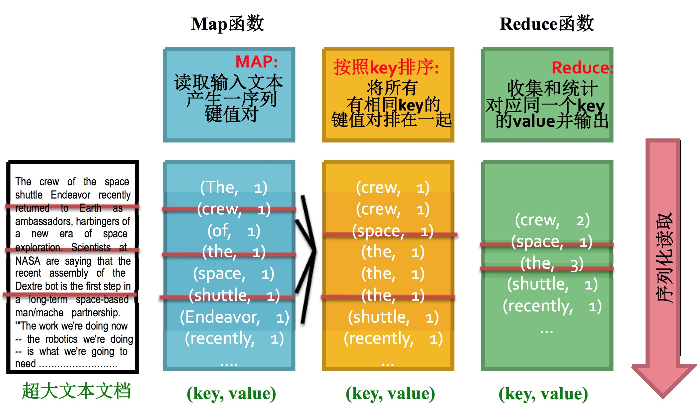

# Hadoop经典案例--词频统计

目录：
* 目录
{:toc}

## Hadoop经典案例：词频统计


我们前面提完了用hadoop完成大数据处理的一些基本知识，这次实验咱们一起来学习一下，如何编写Hadoop的map/reduce任务，完成大数据的处理。

这是一个非常经典的例子，几乎在任何的hadoop教材上都会看到它，即使如此，它依旧是最经典最有代表性的案例，学习大数据处理，可以从先理解清楚它入手。

## 总体流程

咱们来看看对特别大的文件统计，整个过程是如何分拆的。<br>
大家想想词频统计的过程，如果是单机完成，我们需要做的事情是维护一个计数器字典，对每次出现的词，词频+1.但是当数据量非常大的时候，没办法在内存中维护这么大的一个字典，我们就要换一种思路来完成这个任务了，也就是我们所谓的map-reduce过程。

大体的过程画成图是下面这个样子：


大概是分成下面几个环节：

- **Map阶段**
    - 主要完成key-value对生成，这里是每看到一个单词，就输出(单词，1)的kv对
- **排序阶段**
    - 对刚才的kv对进行排序，这样相同单词就在一块儿了
- **Reduce阶段**
    - 对同一个单词的次数进行汇总，得到(词，频次)对


## Map阶段代码

流程大家都看清楚啦，咱们来看看用代码如何实现，你猜怎么着，有了hadoop streaming，咱们可以用python脚本完成map和reduce的过程，然后把整个流程跑起来！

比如咱们map阶段要做的就是把每一个单词和出现1次的信息输出来！所以我们写一个mapper.py文件，具体内容如下：

```python
#coding: utf-8
#!/usr/bin/env python

import sys

# 从标准输入过来的数据
for line in sys.stdin:
    # 把首位的空格去掉
    line = line.strip()
    # 把这一行文本切分成单词(按照空格)
    words = line.split(" ")
    # 对见到的单词进行次数标注(出现1次)
    for word in words:
        print('%s\t%s' % (word, 1))
```

对，就这么简单，你看到了，对于输入进来的每一行，我们做完切分之后，都会输出(单词，1)这样一个kv对，表明这个单词出现过。


## 排序阶段
中间会有一个对上述结果进行排序的过程，以保证所有相同的单词都在一起，不过不用担心，这个过程是系统会自动完成的，因此不用我们编写额外的代码。

## Reduce阶段

接下来就是对map排序后的结果进行汇总了，这个阶段我们可以用一个reducer.py的python脚本来完成，具体完成的任务，就是：

对于读入的(单词，1)对

- 如果这个单词还没有结束（排序后所有相同的单词都在一起了），我们就对单词的次数+1
- 如果遇到新单词了，那重新开始对新单词计数

基于上面的想法，我们可以完成以下的reducer.py脚本：

```python
#coding: utf-8
#!/usr/bin/env python

from operator import itemgetter
import sys

current_word = None
current_count = 0
word = None

# 依旧是标准输入过来的数据
for line in sys.stdin:
    # 去除左右空格
    line = line.strip()

    # 按照tab键对行切分，得到word和次数1
    word, count = line.split('\t', 1)

    # 你得到的1是一个字符串，需要对它进行类型转化
    try:
        count = int(count)
    except ValueError:
        #如果不能转成数字，输入有问题，调到下一行
        continue

    # 如果本次读取的单词和上一次一样，对次数加1
    if current_word == word:
        current_count += count
    else:
        if current_word:
            # 输出统计结果
            print '%s\t%s' % (current_word, current_count)
        current_count = count
        current_word = word

# 不要忘了最后一个词哦，也得输出结果
if current_word == word:
    print '%s\t%s' % (current_word, current_count)
```

怎么样，2个脚本是不是很好懂？


## 本地模拟测试代码
一般情况下，我们不会一遍遍用hadoop streaming执行任务，去测试脚本写得对不对，这个过程太麻烦了。

有没有本地可以测试的办法？有！

我们可以利用linux管道模拟map-reduce的过程！比如我们可以下面这样测试：

```python
# very basic test
user@ubuntu:~$ echo "foo foo quux labs foo bar quux" | /home/hduser/mapper.py
foo     1
foo     1
quux    1
labs    1
foo     1
bar     1
quux    1

user@ubuntu:~$ echo "foo foo quux labs foo bar quux" | /home/hduser/mapper.py | sort -k1,1 | /home/hduser/reducer.py
bar     1
foo     3
labs    1
quux    2

# 用一本英文电子书作为输入测试一下！比如可以在http://www.gutenberg.org/etext/20417下载到！
user@ubuntu:~$ cat /tmp/gutenberg/20417-8.txt | /home/hduser/mapper.py
 The     1
 Project 1
 Gutenberg       1
 EBook   1
 of      1

# 后面的sort和reducer过程是一样的，自己试一下！
```

## Hadoop集群运行案例

如果测试通过了，我们就可以在集群上运行我们的案例了，我们先从下面3个链接拉取3本电子书。
[The Outline of Science, Vol. 1 (of 4) by J. Arthur Thomson](http://www.gutenberg.org/etext/20417)<br>
[The Notebooks of Leonardo Da Vinci](http://www.gutenberg.org/etext/5000)<br>
[Ulysses by James Joyce](http://www.gutenberg.org/etext/4300)<br>

我们把它们下载到一个本地路径下，比如/tmp/gutenberg

```
user@ubuntu:~$ ls -l /tmp/gutenberg/
total 3604
-rw-r--r-- 1 hduser hadoop  674566 Feb  3 10:17 pg20417.txt
-rw-r--r-- 1 hduser hadoop 1573112 Feb  3 10:18 pg4300.txt
-rw-r--r-- 1 hduser hadoop 1423801 Feb  3 10:18 pg5000.txt
user@ubuntu:~$
```

### 拷贝文件到HDFS上
我们前面给大家准备好的HDFS命令小抄在这里派上用场了！执行下面的命令：
```
user@ubuntu:/usr/local/hadoop$ bin/hadoop dfs -copyFromLocal /tmp/gutenberg /user/hduser/gutenberg
hduser@ubuntu:/usr/local/hadoop$ bin/hadoop dfs -ls
Found 1 items
drwxr-xr-x   - user supergroup          0 2016-05-08 17:40 /user/hduser/gutenberg
user@ubuntu:/usr/local/hadoop$ bin/hadoop dfs -ls /user/hduser/gutenberg
Found 3 items
-rw-r--r--   3 hduser supergroup     674566 2016-05-10 11:38 /user/hduser/gutenberg/pg20417.txt
-rw-r--r--   3 hduser supergroup    1573112 2016-05-10 11:38 /user/hduser/gutenberg/pg4300.txt
-rw-r--r--   3 hduser supergroup    1423801 2016-05-10 11:38 /user/hduser/gutenberg/pg5000.txt
user@ubuntu:/usr/local/hadoop$
```

### 执行map-reduce任务
下面我们就可以用hadoop streaming执行map-reduce任务了，命令行执行
```
user@ubuntu:/usr/local/hadoop$ bin/hadoop jar contrib/streaming/hadoop-*streaming*.jar \
-file /home/hduser/mapper.py    \
-mapper /home/hduser/mapper.py \
-file /home/hduser/reducer.py   \
-reducer /home/hduser/reducer.py \
-input /user/hduser/gutenberg/* \
-output /user/hduser/gutenberg-output
```

你甚至可以用-D去指定reducer的个数：

```
user@ubuntu:/usr/local/hadoop$ bin/hadoop jar contrib/streaming/hadoop-*streaming*.jar -D mapred.reduce.tasks=16 ...
```

运行的结果过程输出的信息大概是下面这个样子：

```
user@ubuntu:/usr/local/hadoop$ bin/hadoop jar contrib/streaming/hadoop-*streaming*.jar -mapper /home/hduser/mapper.py -reducer /home/hduser/reducer.py -input /user/hduser/gutenberg/* -output /user/hduser/gutenberg-output
 additionalConfSpec_:null
 null=@@@userJobConfProps_.get(stream.shipped.hadoopstreaming
 packageJobJar: [/app/hadoop/tmp/hadoop-unjar54543/]
 [] /tmp/streamjob54544.jar tmpDir=null
 [...] INFO mapred.FileInputFormat: Total input paths to process : 7
 [...] INFO streaming.StreamJob: getLocalDirs(): [/app/hadoop/tmp/mapred/local]
 [...] INFO streaming.StreamJob: Running job: job_200803031615_0021
 [...]
 [...] INFO streaming.StreamJob:  map 0%  reduce 0%
 [...] INFO streaming.StreamJob:  map 43%  reduce 0%
 [...] INFO streaming.StreamJob:  map 86%  reduce 0%
 [...] INFO streaming.StreamJob:  map 100%  reduce 0%
 [...] INFO streaming.StreamJob:  map 100%  reduce 33%
 [...] INFO streaming.StreamJob:  map 100%  reduce 70%
 [...] INFO streaming.StreamJob:  map 100%  reduce 77%
 [...] INFO streaming.StreamJob:  map 100%  reduce 100%
 [...] INFO streaming.StreamJob: Job complete: job_200803031615_0021
 [...] INFO streaming.StreamJob: Output: /user/hduser/gutenberg-output
user@ubuntu:/usr/local/hadoop$
```

### 查看执行结果
上面的信息告诉我们任务执行成功了，结果文件存储在hdfs上的/user/hduser/gutenberg-output目录下，我们来看一眼(是的，HDFS小抄又可以用上了)。

```
user@ubuntu:/usr/local/hadoop$ bin/hadoop dfs -ls /user/hduser/gutenberg-output
Found 1 items
/user/hduser/gutenberg-output/part-00000     &lt;r 1&gt;   903193  2017-03-21 13:00
user@ubuntu:/usr/local/hadoop$
```

还可以直接查看结果的内容：

```
user@ubuntu:/usr/local/hadoop$ bin/hadoop dfs -cat /user/hduser/gutenberg-output/part-00000
"(Lo)cra"       1
"1490   1
"1498," 1
"35"    1
"40,"   1
"A      2
"AS-IS".        2
"A_     1
"Absoluti       1
[...]
user@ubuntu:/usr/local/hadoop$
```