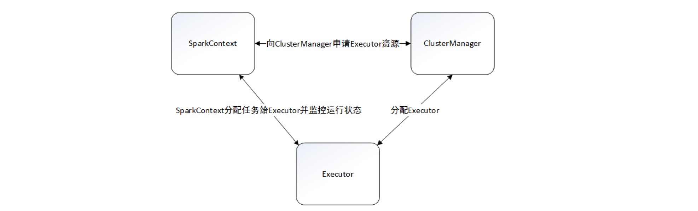

# Spark 核心概念与操作

目录：
* 目录
{:toc}


## spark简介

[Apache Spark](http://spark.apache.org/)是新兴的一种快速通用的大规模数据处理引擎。它的优势有三个方面：

- **通用计算引擎** 能够运行MapReduce、数据挖掘、图运算、流式计算、SQL等多种框架；
- **基于内存** 数据可缓存在内存中，特别适用于需要迭代多次运算的场景；
- **与Hadoop集成** 能够直接读写HDFS中的数据，并能运行在YARN之上。

Spark是用Scala语言编写的，所提供的API也很好地利用了这门语言的特性，当然作为数据科学的一环，它也可以使用Java和Python编写应用。这里我们将用Python给大家做讲解。

## spark核心

Spark支持多种运行模式。单机部署下，既可以用本地（Local）模式运行，也可以使用伪分布式模式来运行；当以分布式集群部署的时候，可以根据实际情况选择Spark自带的独立（Standalone）运行模式、YARN运行模式或者Mesos模式。虽然模式多，但是Spark的运行架构基本由三部分组成，包括**SparkContext（驱动程序）**、**ClusterManager（集群资源管理器）**和**Executor（任务执行进程）**。　


- SparkContext提交作业，向ClusterManager申请资源；
- ClusterManager会根据当前集群的资源使用情况，进行有条件的FIFO策略：先分配的应用程序尽可能多地获取资源，后分配的应用程序则在剩余资源中筛选，没有合适资源的应用程序只能等待其他应用程序释放资源；
- ClusterManager默认情况下会将应用程序分布在尽可能多的Worker上，这种分配算法有利于充分利用集群资源，适合内存使用多的场景，以便更好地做到数据处理的本地性；另一种则是分布在尽可能少的Worker上，这种适合CPU密集型且内存使用较少的场景；
- Excutor创建后与SparkContext保持通讯，SparkContext分配任务集给Excutor，Excutor按照一定的调度策略执行任务集。

Spark包含1个**driver(笔记本电脑或者集群网关机器上)**和若干个**executor(在各个节点上)**，通过**`SparkContext`(简称`sc`)**连接`Spark集群`、`创建RDD`、`累加器（accumlator）`、`广播变量（broadcast variables）`，简单可以认为SparkContext（驱动程序）是Spark程序的根本。

**Driver**会把计算任务分成一系列小的**task**，然后送到**executor**执行。executor之间可以通信，在每个executor完成自己的task以后，所有的信息会被传回。

  

## RDD(弹性分布式数据集)介绍

在Spark里，所有的处理和计算任务都会被组织成一系列**Resilient Distributed Dataset(弹性分布式数据集，简称RDD)**上的**transformations(转换)** 和 **actions(动作)**。

RDD是一个包含诸多元素、被划分到不同节点上进行并行处理的数据集合，可以将RDD持久化到内存中，这样就可以有效地在并行操作中复用（在机器学习这种需要反复迭代的任务中非常有效）。在节点发生错误时RDD也可以自动恢复。

说起来，RDD就像一个NumPy `array`或者一个Pandas `Series`，可以视作一个有序的item集合。<br>
只不过这些item并不存在driver端的内存里，而是被分割成很多个**partitions**，每个partition的数据存在集群的executor的内存中。

**RDD是最重要的载体，我们看看如何初始化这么一个对象**:

### 初始化RDD方法1
如果你本地内存中已经有一份序列数据(比如python的list)，你可以通过`sc.parallelize`去初始化一个RDD<br>
当你执行这个操作以后，list中的元素将被自动分块(partitioned)，并且把每一块送到集群上的不同机器上。

```python
import pyspark
from pyspark import SparkContext
from pyspark import SparkConf
conf=SparkConf().setAppName("miniProject").setMaster("local[*]")
sc=SparkContext.getOrCreate(conf)

my_list = [1,2,3,4,5] #存放在当前环境内存当中的list

rdd = sc.parallelize(my_list)
rdd
rdd.getNumPartitions()
```
**如果你想看看分区状况怎么办**
```
rdd.glom().collect()
```

```
结果分别为: 
ParallelCollectionRDD[2] at parallelize at PythonRDD.scala:195, 
4, 
[[1, 2], [3, 4, 5]]
```
在这个例子中，是一个2-core的CPU笔记本
Spark创建了2个executor，然后把数据分成2个块。

**Tips：使用`sc.parallelize`，你可以把Python list，NumPy array或者Pandas `Series`、Pandas `DataFrame`转成Spark RDD。**

### 初始化RDD方法2

第2种方式当然是直接把文本读到RDD了<br>
你的每一行都会被当做一个item，不过需要注意的一点是，**Spark一般默认你的路径是指向HDFS的，如果你要从本地读取文件的话，给一个`file://`开头的全局路径**。

```python
# File from Pandas exercises
rdd = sc.textFile("../data/yob1880.txt")
rdd
```
textFile读取的每一行为rdd的一个item。

你甚至可以很粗暴地读入整个文件夹的所有文件。<br>
但是要特别注意，这种读法，**RDD中的每个item实际上是一个形如(文件名，文件所有内容)的元组。**<br>
咱们来试着读一读所有的文件

```python 
# Record current path for future use
import os
cwd = os.getcwd()
cwd

# File from Pandas exercises
rdd = sc.textFile("file://" + cwd + "/names/yob1880.txt")
rdd

rdd = sc.wholeTextFiles("file://" + cwd + "/names")
rdd
# 取出第一行（tips：`rdd.first()`) 统计行数（tips：`rdd.count()`）
rdd.first()  
```
```
运行结果：
org.apache.spark.api.java.JavaPairRDD@70cfdcfd

('file:/jhub/students/home/un5dbf7c912e3cc/course6/data/yob1880.txt',
'Mary,F,7065\nAnna,F,2604\nEmma,F,2003\nElizabeth,F,1939\nMinnie,F,1746\nMargaret,F,1578\nIda,F,1472\nAlice,F,1414\nBertha,F,1320\nSarah,F,1288\nAnnie,F,1258\nClara,F,1226\nElla,F,1156\nFlorence,F,1063...')
```

### 其余初始化RDD的方法
RDD还可以通过其他的方式初始化，包括
* **HDFS上的文件**
* **Hive中的数据库与表**
* **Spark SQL得到的结果**

后面会提到这个部分


## RDD transformations和actions

大家还对python的list comprehension有印象吗，RDDs可以进行一系列的**变换**得到新的RDD，有点类似那个过程，我们先给大家提一下RDD上最最常用到的transformation:
* **`map()` 对RDD的每一个item都执行同一个操作**
* **`flatMap()` 对RDD中的item执行同一个操作以后得到一个list，然后以平铺的方式把这些list里所有的结果组成新的list**
* **`filter()` 筛选出来满足条件的item**
* **`distinct()` 对RDD中的item去重**
* **`sample()` 从RDD中的item中采样一部分出来，有放回或者无放回**
* **`sortBy()` 对RDD中的item进行排序**

**如果你想看操作后的结果，可以用一个叫做`collect()`的**action**把所有的item转成一个Python list。**

简单的例子如下:
```python
numbersRDD = sc.parallelize(range(1,10+1))
print(numbersRDD.collect())

squaresRDD = numbersRDD.map(lambda x: x**2)  # 1进1出
print(squaresRDD.collect())

filteredRDD = numbersRDD.filter(lambda x: x % 2 == 0)  # Only the evens
print(filteredRDD.collect())
```

```
运行结果:
[1, 2, 3, 4, 5, 6, 7, 8, 9, 10]
[1, 4, 9, 16, 25, 36, 49, 64, 81, 100]
[2, 4, 6, 8, 10]
```
然后咱们看看**`flatMap()`**的平展功能:

```python
sentencesRDD = sc.parallelize(['Hello world', 'My name is Patrick'])
wordsRDD = sentencesRDD.flatMap(lambda sentence: sentence.split(" "))
print(wordsRDD.collect())
print(wordsRDD.count())
```

```
运行结果:
['Hello', 'world', 'My', 'name', 'is', 'Patrick']
6
```
为了做一个小小的对应，咱们看看python里对应的操作大概是什么样的:
```python
l = ['Hello world', 'My name is Patrick']
ll = []
for sentence in l:
    ll = ll + sentence.split(" ")
ll
```

```
运行结果:
['Hello', 'world', 'My', 'name', 'is', 'Patrick']
```
比较炫酷的是，**前面提到的Transformation，可以一个接一个地串联**，比如:
```python
# [1, 2, 3, 4, 5, 6, 7, 8, 9, 10]
def doubleIfOdd(x):
    if x % 2 == 1:
        return 2 * x
    else:
        return x

resultRDD = (numbersRDD           # In parentheses so we can write each
             .map(doubleIfOdd)    # transformation in one line
             .filter(lambda x: x > 6)
             .distinct())

resultRDD.collect()
```
```
运行结果:
[8, 10, 18, 14]
```

## RDD间的操作

如果你手头上有2个RDD了，下面的这些操作能够帮你对他们以个种方式组合得到1个RDD:
* **`rdd1.union(rdd2)`: 所有`rdd1`和`rdd2`中的item组合**
* **`rdd1.intersection(rdd2)`: `rdd1` 和 `rdd2`的交集**
* **`rdd1.substract(rdd2)`: 所有在`rdd1`中但不在`rdd2`中的item（差集）**
* **`rdd1.cartesian(rdd2)`: `rdd1` 和 `rdd2`中所有的元素笛卡尔乘积 **

简单的例子如下:
```python
numbersRDD = sc.parallelize([1,2,3])
moreNumbersRDD = sc.parallelize([2,3,4])

numbersRDD.union(moreNumbersRDD).collect() # [1, 2, 3, 2, 3, 4]

numbersRDD.intersection(moreNumbersRDD).collect() # [2, 3]

numbersRDD.subtract(moreNumbersRDD).collect() # [1]

numbersRDD.cartesian(moreNumbersRDD).collect() # [(1, 2), (1, 3), (1, 4), (2, 2), (2, 3), (2, 4), (3, 2), (3, 3), (3, 4)]
```

**特别注意**：Spark的一个核心概念是**惰性计算**。当你把一个RDD转换成另一个的时候，这个转换不会立即生效执行！！！<br>Spark会把它先记在心里，等到真的需要拿到转换结果的时候，才会重新组织你的transformations(因为可能有一连串的变换)<br>
这样可以避免不必要的中间结果存储和通信。

刚才提到了**惰性计算**，那么什么东西能让它真的执行转换与运算呢？
是的，就是我们马上提到的**Actions**，下面是常见的action，当他们出现的时候，表明我们需要执行刚才定义的transform了:
* `collect()`: 计算所有的items并返回所有的结果到driver端，接着 `collect()`会以Python list的形式返回结果
* `first()`: 和上面是类似的，不过只返回第1个item
* `take(n)`: 类似，但是返回n个item
* `count()`: 计算RDD中item的个数
* `top(n)`: 返回头n个items，按照自然结果排序
* `reduce()`: 对RDD中的items做聚合

我们之前已经看过 `collect()`, `first()` 和 `count()` 的例子了。  咱们看看 `reduce()` 如何使用。比如Spark里从1加到10你可以这么做。

```python
# [1, 2, 3, 4, 5, 6, 7, 8, 9, 10]
rdd = sc.parallelize(range(1,10+1))
rdd.reduce(lambda x, y: x + y) # 55
```

如果你想了解一下`reduce`的细节的话，其实可能会先在每个分区(partition)里完成reduce操作，然后再全局地进行reduce。<br>
这个过程你可以从如下的代码大致理解。


```python
def f(x,y):
    return x + y

l = [1,2,3,4]
f(f(f(l[0],l[1]), l[2]), l[3]) # 10
```

有一个很有用的操作，我们试想一下，有时候我们需要重复用到某个transform序列得到的RDD结果。但是一遍遍重复计算显然是要开销的，所以我们可以通过一个叫做`cache()`的操作把它暂时地存储在内存中:

```python
# Calculate the average of all the squares from 1 to 10
import numpy as np
numbersRDD = sc.parallelize(np.linspace(1.0, 10.0, 10))
squaresRDD = numbersRDD.map(lambda x: x**2)

squaresRDD.cache()  # Preserve the actual items of this RDD in memory

avg = squaresRDD.reduce(lambda x, y: x + y) / squaresRDD.count()
print(avg) # 38.5
```

缓存RDD结果对于重复迭代的操作非常有用，比如很多机器学习的算法，训练过程需要重复迭代。

## 针对更复杂结构的transformations和actions

咱们刚才已经见识到了`Spark`中最常见的transform和action，但是有时候我们会遇到更复杂的结构，比如非常非常经典的是以元组形式组织的k-v对（key, value）<br>
我们把它叫做**pair RDDs**，而Sark中针对这种item结构的数据，定义了一些transformation和action:
* `reduceByKey()`: 对所有有着相同key的items执行reduce操作
* `groupByKey()`: 返回类似(key, listOfValues)元组的RDD，后面的value List 是同一个key下面的
* `sortByKey()`: 按照key排序
* `countByKey()`: 按照key去对item个数进行统计
* `collectAsMap()`: 和collect有些类似，但是返回的是k-v的字典

以下是Spark中的一些例子<br>
怎么说呢，统计这个案例算是分布式（hadoop/spark）相关知识中的“Hello World”

```python
rdd = sc.parallelize(["Hello hello", "Hello New York", "York says hello"])
resultRDD = (
    rdd
    .flatMap(lambda sentence: sentence.split(" "))  # split into words
    .map(lambda word: word.lower())                 # lowercase
    .map(lambda word: (word, 1))                    # count each appearance
    .reduceByKey(lambda x, y: x + y)                # add counts for each word
)
resultRDD.collect()  # [('hello', 4), ('york', 2), ('new', 1), ('says', 1)]
```

我们将结果以k-v字典的形式返回

```python
result = resultRDD.collectAsMap()
result # {'hello': 4, 'york': 2, 'new': 1, 'says': 1}
```

如果你想要出现频次最高的2个词，可以这么做:

```python
print(resultRDD
      .sortBy(keyfunc=lambda x: x[1], ascending=False)
      .take(2))  # [('hello', 4), ('york', 2)]
```

还有一个很有意思的操作是，在给定2个pairRDD后，我们可以通过一个类似SQL的方式去join他们。

```python
# Home of different people
homesRDD = sc.parallelize([
        ('Brussels', 'John'),
        ('Brussels', 'Jack'),
        ('Leuven', 'Jane'),
        ('Antwerp', 'Jill'),
    ])

# Quality of life index for various cities
lifeQualityRDD = sc.parallelize([
        ('Brussels', 10),
        ('Antwerp', 7),
        ('RestOfFlanders', 5),
    ])
```
```python
'''[('Brussels', ('John', 10)),
 ('Brussels', ('Jack', 10)),
 ('Antwerp', ('Jill', 7))]'''
homesRDD.join(lifeQualityRDD).collect()
```
```python
'''[('Brussels', ('John', 10)),
 ('Brussels', ('Jack', 10)),
 ('Antwerp', ('Jill', 7)),
 ('Leuven', ('Jane', None))]'''
homesRDD.leftOuterJoin(lifeQualityRDD).collect()
```
```python
'''[('Brussels', ('John', 10)),
 ('Brussels', ('Jack', 10)),
 ('Antwerp', ('Jill', 7)),
 ('RestOfFlanders', (None, 5))]'''
homesRDD.rightOuterJoin(lifeQualityRDD).collect()
```

```python
'''[('Brussels',
  (<pyspark.resultiterable.ResultIterable at 0x13ff8a30358>,
   <pyspark.resultiterable.ResultIterable at 0x13ff8a309e8>)),
 ('Antwerp',
  (<pyspark.resultiterable.ResultIterable at 0x13ff8a30e80>,
   <pyspark.resultiterable.ResultIterable at 0x13ff8a30ac8>)),
 ('RestOfFlanders',
  (<pyspark.resultiterable.ResultIterable at 0x13ff8a30b70>,
   <pyspark.resultiterable.ResultIterable at 0x13ff8a30f28>)),
 ('Leuven',
  (<pyspark.resultiterable.ResultIterable at 0x13ff8a302b0>,
   <pyspark.resultiterable.ResultIterable at 0x13ff8a30fd0>))]'''
homesRDD.cogroup(lifeQualityRDD).collect()
```

```python
''' 
Oops!  Those <ResultIterable>s are Spark's way of returning a list
that we can walk over, without materializing the list.
Let's materialize the lists to make the above more readable:
输出结果：
[('Brussels', (['John', 'Jack'], [10])),
 ('Antwerp', (['Jill'], [7])),
 ('RestOfFlanders', ([], [5])),
 ('Leuven', (['Jane'], []))]
'''
(homesRDD
 .cogroup(lifeQualityRDD)
 .map(lambda x:
        (x[0], (list(x[1][0]), list(x[1][1]))))
 .collect())
```